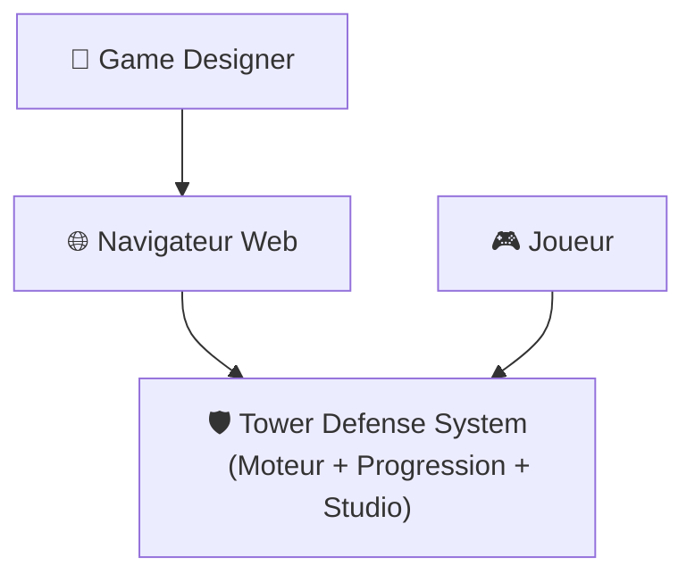
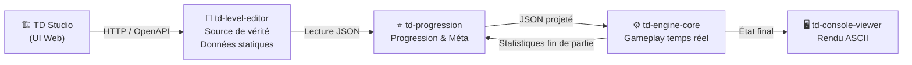
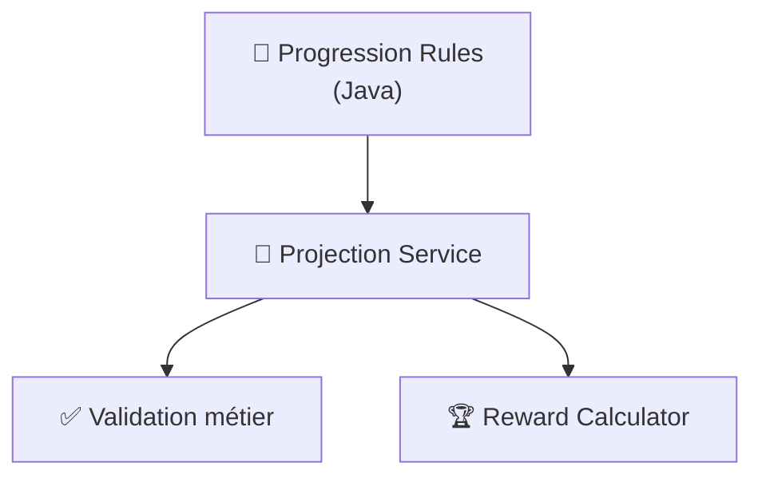
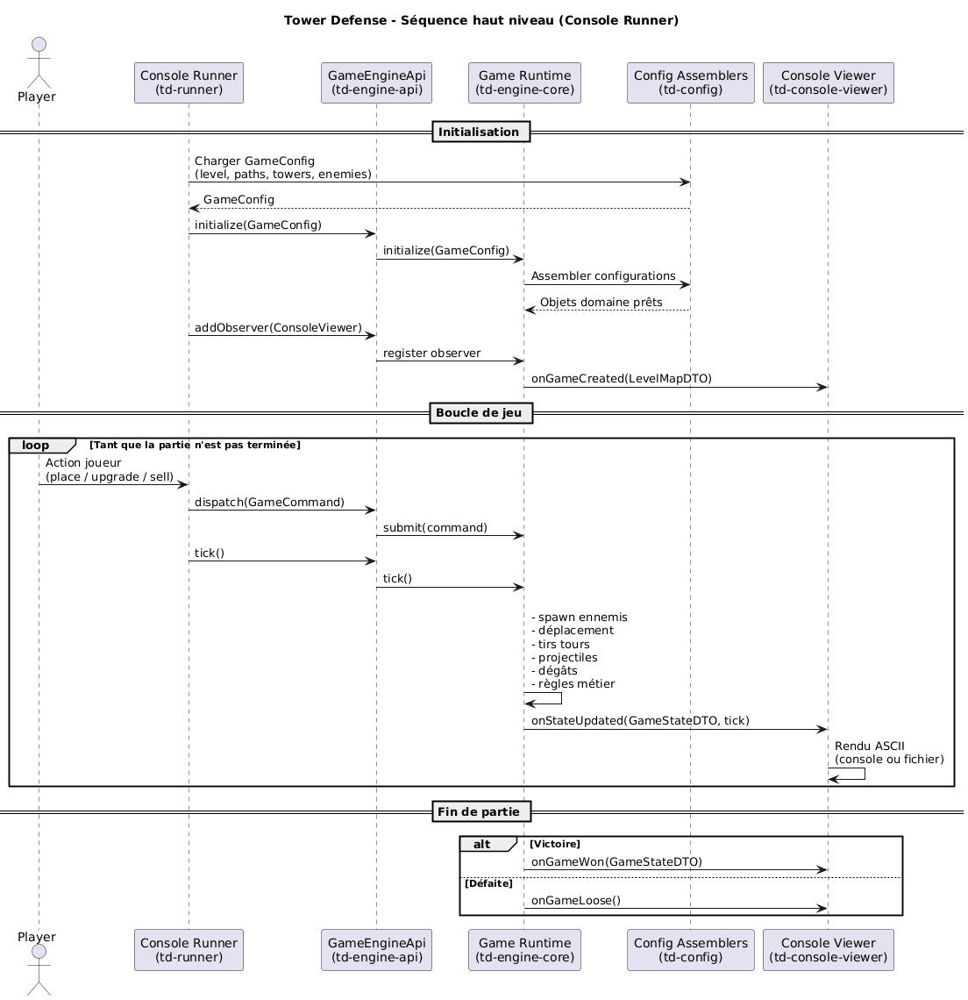

# 🛡️ Tower Defense – Moteur de jeu Java modulaire

Un moteur de Tower Defense extensible, orienté architecture propre et conception métier.

---

## 📌 Présentation générale

Ce dépôt contient un **moteur de jeu Tower Defense modulaire**, développé en **Java 21**, avec un fort accent mis sur :

* la **séparation stricte des responsabilités**,
* une approche **Domain-Driven Design (DDD)**,
* la **testabilité** et l’évolutivité,
* l’indépendance totale entre moteur, règles métier et rendu.

Le projet a vocation à servir à la fois de :

* 🎮 **simulation jouable** de Tower Defense,
* 🧱 **socle technique** pour expérimenter des mécaniques de jeu,
* 🧪 **terrain d’exploration architectural** (API, moteur headless, observateurs, rendering).

---

## ✨ Fonctionnalités clés

✔ Java 21 uniquement (aucune dette legacy)

✔ Architecture modulaire Maven

✔ Moteur de jeu totalement headless

✔ Boucle de jeu basée sur des ticks

✔ Configuration du gameplay par fichiers (niveaux, vagues, tours, ennemis)

✔ API publique stable (DTOs, commandes, observateurs)

✔ Rendu ASCII console et fichier

✔ CI GitHub Actions avec build incrémental


---

## 🗂️ Structure du projet

```text
tower-defense
├── pom.xml                     # POM parent Maven
├── .github/workflows/ci.yml     # Pipeline CI GitHub Actions
│
├── td-engine                    # Moteur de jeu
│   ├── td-engine-api            # API publique (DTO, commandes, observateurs)
│   ├── td-engine-core           # Implémentation du moteur
│   │   ├── td-domain            # Modèle métier (état, entités, règles)
│   │   ├── td-gameplay          # Logique de jeu
│   │   ├── td-sequencer         # Séquencement ticks / commandes
│   │   ├── td-config            # Assemblage et mapping de configuration
│   │   ├── td-back-tower        # Règles métier des tours
│   │   ├── td-aop               # Aspects transverses (logs)
│   │   └── td-engine-starter    # Bootstrap du moteur
│   ├── td-engine-http           # Exposition HTTP (expérimental)
│   └── td-engine-tests          # Tests du moteur
│
├── td-console-viewer            # Rendu ASCII console / fichier
├── td-runner                    # Lanceur de parties
├── td-level-editor              # Éditeur de niveaux (WIP)
├── td-progression               # Utilitaires transverses
│
├── level-1.json                 # Exemple de configuration de niveau
└── scenario/                    # Univers narratif & game design (Obsidian)
```

---

## 🧠 Vue d’ensemble de l’architecture

### 🔌 API du moteur (`td-engine-api`)

Cette couche définit les **contrats publics stables** du moteur :

* Interfaces `GameEngineApi`, `GameRuntime`
* Commandes (`PlaceTowerCommand`, `UpgradeTowerCommand`, `SellTowerCommand`)
* Observateurs (`GameStateObserver`)
* DTOs immuables (`GameStateDTO`, `TowerDTO`, `EnemyDTO`, …)

⚠ Aucune logique métier n’est présente dans cette couche.

---

### ⚙️ Cœur du moteur (`td-engine-core`)

Le moteur implémente l’intégralité des règles du jeu :

* 🕒 Avancement par ticks
* 👾 Déplacement des ennemis et gestion des vagues
* 🗼 Cycle de vie des tours (construction, recharge, amélioration)
* 💥 Gestion des tirs et projectiles
* ❤️ Conditions de victoire et de défaite

➜ Le moteur est totalement indépendant de toute technologie de rendu.

---

### 🧩 Système de configuration (`td-config`)

Le gameplay est **entièrement piloté par la configuration** :

* Niveaux et attaques
* Vagues d’ennemis
* Types d’ennemis et usines associées
* Types de tours et niveaux d’amélioration
* Chemins suivis par les ennemis

Des **assemblers** et **mappers dédiés** assurent la transformation DTO ➜ domaine.

---

### 🧠 Couche Méta (progression & multi-niveaux)

Le projet distingue explicitement le moteur de jeu du système de progression méta.

La couche méta n’est pas responsable de l’exécution d’une partie, mais de tout ce qui l’entoure :
enchaînement des niveaux, évolution des tours, récompenses, et persistance de la progression du joueur.

---
### 🎯 Rôle de la méta

La méta a pour responsabilités principales :

- 🧩 Gérer la progression multi-niveaux
- 🌳 Définir et appliquer des arbres d’évolution (tours, ennemis, capacités)
- 🏆 Calculer les récompenses à l’issue d’une partie
- 📊 Exploiter les statistiques de fin de partie produites par le moteur
- 🔄 Projeter des capacités effectives en fonction de la progression du joueur

⚠ La méta ne contient aucune logique de gameplay temps réel.

---
### 🗂️ Sources de vérité & flux de données

Le projet repose sur une séparation stricte des rôles :

🧱 TD Level Studio (contenu de base)
- Source de vérité des données statiques
- Définit :
	- niveaux
	- types de tours
	- types d’ennemis
- Données immuables, versionnées et analysables
- Exemple :
``` json
{ "range": 2.0, "damage": 20 }
```
---
### 🧠 Progression (projection & progression)

- Lit les données du TD Level Studio
- Applique ses règles de progression en fonction du joueur
- Ne modifie jamais les données sources
- Produit un JSON dérivé, spécifique à :
	- un joueur
	- un instant
	- un mode de jeu

Exemple (projection calculée) :
``` json
{ "range": 2.2, "damage": 25 }
```

Les règles de progression restent internes à la méta
(le moteur ne reçoit jamais de formules ou de bonus).

---
### ⚙️ Moteur de jeu

- Consomme uniquement des données finales
- Ignore totalement :
	- la progression
	- la méta
	- l’origine des valeurs
- Exécute la partie de manière déterministe

👉 Le moteur reste totalement agnostique de la méta.

---
### 🔄 Retour moteur → méta

À la fin d’une partie, le moteur produit un résumé neutre :
- victoire / défaite
- durée
- vies restantes
- ennemis éliminés
- tours construites / améliorées
- statistiques agrégées

La méta consomme ce résultat pour :
- calculer les récompenses
- mettre à jour la progression
- ajuster l’équilibrage

⚠ Le moteur ne calcule jamais de récompenses ou d’XP.

---
### 🧩 Principes clés de conception méta

🧱 Le contenu de base est immuable

🧠 La méta projette, elle ne modifie pas

⚙️ Le moteur consomme des valeurs finales

🔁 Les projections sont jetables et recalculables

🧪 Chaque couche est testable indépendamment

---
### 🧭 Objectif à long terme

Cette séparation permet :
- d’évoluer la méta sans casser le moteur
- d’analyser les niveaux avec différents profils de joueurs
- de rejouer une partie passée avec de nouvelles règles de progression
- de supporter plusieurs modes de jeu (campagne, sandbox, hardcore)
---
### 🖥️ Rendu ASCII (`td-console-viewer`)

Le viewer console fournit un rendu ASCII riche :

* 🗺️ Plateau en grille
* 🗼 Tours, 👾 ennemis, ▪️ projectiles
* ➡️ Chemins directionnels
* 💰 Or, ❤️ vies, 📊 progression

Deux modes sont disponibles :

* `ConsoleViewer` → affichage temps réel
* `FileViewer` → dump ASCII par tick dans un fichier

Le rendu repose sur un **registre de renderers extensible**.

---

## 🧱 Architecture

### Vue d’ensemble (C4 – Context)


### Conteneurs principaux (C4 – Containers)



🟨 C3 — Vue interne de td-progression



## 🔄 Boucle de jeu

```text
Initialisation
   ↓
Enregistrement des observers
   ↓
Soumission des commandes
   ↓
Tick du moteur
   ↓
Notification des observers
   ↓
Victoire ☑ ou Défaite ✖
```

---

## 🧩 Séquence d’exécution (vue haut niveau)



---
## 🛠️ Build & exécution

### Prérequis

✔ Java 21
✔ Maven 3.9+

### Build complet

```bash
mvn clean verify
```

### Build ciblé

```bash
mvn -pl td-engine-core -am clean test
```

---

## 🤖 Intégration continue

La CI GitHub Actions assure :

* ☕ Setup Java 21 (Temurin)
* 📦 Cache Maven
* 🔍 Build incrémental par module
* 🏷️ Tag automatique sur `main`

Voir : `.github/workflows/ci.yml`

---

## 🎯 Principes de conception

* 📐 Explicite plutôt qu’implicite
* 🔒 DTOs immuables exposés
* 🔀 Séparation lecture / écriture
* 🧪 Testabilité prioritaire
* 🚫 Aucun couplage moteur ↔ rendu

---

## 🚧 État actuel du projet

✔ Moteur de jeu : fonctionnel

✔ Viewer console : fonctionnel

⚠ Couche HTTP : expérimentale

⚠ Éditeur de niveaux : en cours

ℹ Univers narratif : en conception

---

## 🧭 Roadmap indicative

* 🎯 IA de ciblage avancée
* 🛣️ Chemins multiples simultanés
* 💾 Sauvegarde / chargement de partie
* 🖼️ Frontend graphique (JavaFX / Web)
* 📈 Couverture de tests accrue

---

## 🤝 Contribuer

Les contributions sont bienvenues sous réserve de :

* respecter les frontières architecturales,
* éviter toute logique de rendu dans le moteur,
* fournir des tests pour les évolutions métier.

---

## 📜 Licence

Licence à définir.

---

## 👥 Auteurs

Projet maintenu par les contributeurs Tower Defense.
